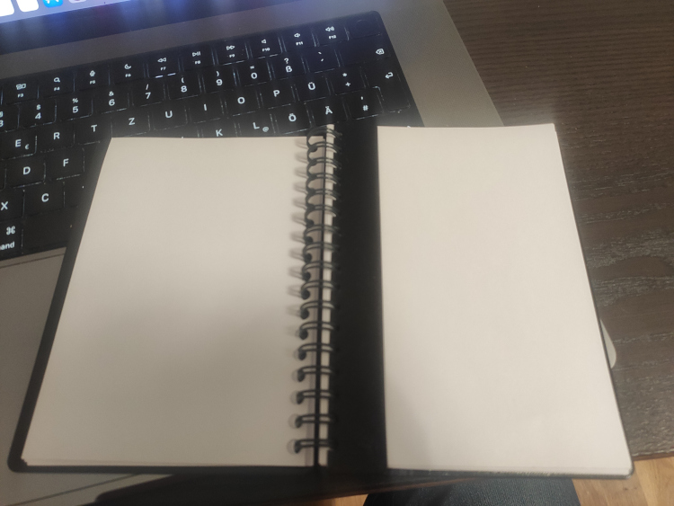
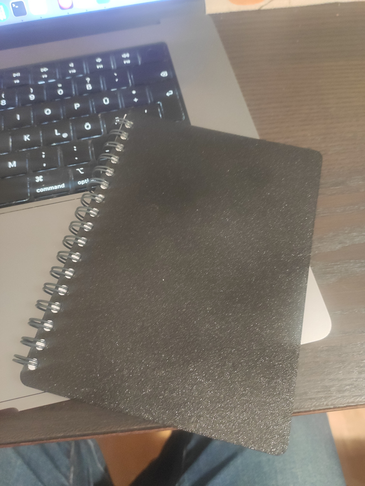

# Custom A6 notebook

Existing notebooks do not appeal to me at all: to make sketches you need blank pages, and most notebooks are either lined or squared. They also lack a bookmark, so you have to tuck random slips of paper inside, which is inconvenient. I want the pages to be A6 size with no rounded corners. The cover should protrude slightly for aesthetics. I thought: why not make my own notebook that is only mine? Said and done!

The pages are plain white; I cut them with a paper guillotine from 80 g/m^2 copy paper. I punched the holes with a regular hole punch and 3D-printed a gauge so the holes line up exactly. I printed the cover on a 3D printer using black PETG plastic, and it looks very stylish. I printed the bookmark-ruler the same way as the cover; it snaps into any spot in the notebook and works both as a bookmark and as a ruler. The spiral came from an old notebook. It turns out you can carefully remove the pages and insert them again. The process takes patience and time, but the result is very pleasing.

I uploaded the print models to [printables](https://www.printables.com/model/1436723-a6-printed-notebook).

One of the perks of A6 spiral-bound notebooks is that when they are closed, you can tuck a pen into the side spiral. Since I can now make the pages myself, as soon as the notebook runs out I just remove the old sheets and insert new ones.

