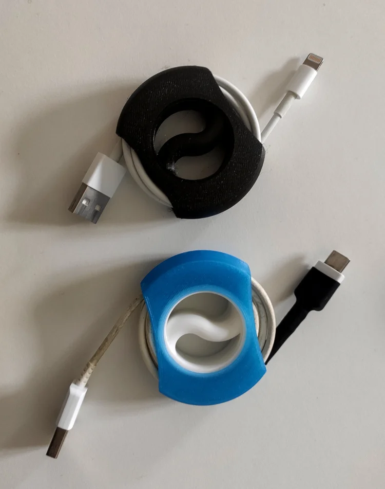

# Customizable Cable Winder

This is cable organizer that I have created to get my micro usb cables get better organized. Thing is developed with OpenSCAD and you can customize is to your needs. Sources are included - enjoy!

This thing is inspired by http://www.thingiverse.com/thing:570074 but I wanted spool that has smoother angles so it would not bend cable too much and made some holes so cable has more space inside and easier to access.

- [Printables](https://www.printables.com/model/1388289-cable-winder)
- [Thingiverse](https://www.thingiverse.com/thing:2281191)

