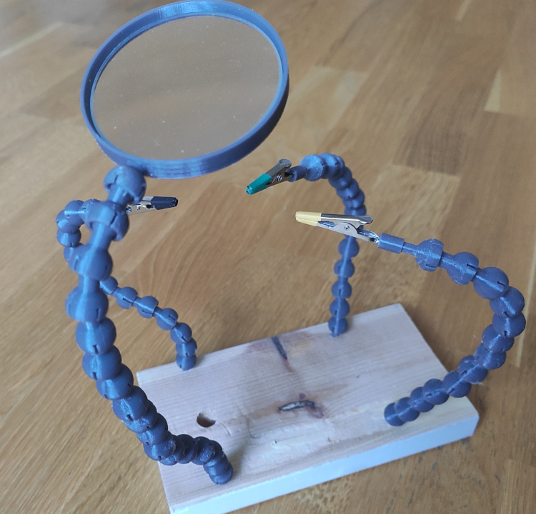

# Third Hand

The third hand I printed from Thingiverse models didn't really work for me, so I made my own.

I reused alligator clips from wires I already had and took the magnifier lens from a reading glass I bought in a bookstore. If your lens has different dimensions, you can adjust the OpenSCAD file to match. PETG is the better choice for printing because PLA loses its shape. ABS or ASA might work even better, though I have not tried them.

The project may evolve in the future, since the printed parts could still be made sturdier, but I need another round of R&D for the next version. :)

- [Printables](https://www.printables.com/model/1430574-third-hand)

